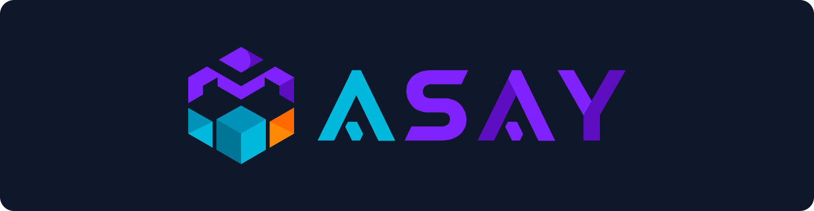

# Asay Solution

### Software House Especializada em Inteligência Artificial

---

## 🚀 Sobre Nós

Somos uma empresa de **consultoria, arquitetura e desenvolvimento de soluções inovadoras em software**, com um portfólio que abrange tecnologias avançadas como **Inteligência Artificial, Machine Learning e computação em nuvem**.

Atuamos com foco em eficiência, personalização e inovação tecnológica, apoiando empresas de todos os setores a se destacarem na era digital com soluções robustas, escaláveis e sustentáveis.

### 🎯 Missão

Capacitar clientes com tecnologias de ponta e soluções personalizadas, mantendo um padrão de excelência e eficiência. Buscamos ser um **parceiro estratégico e confiável**, impulsionando a transformação digital e o crescimento sustentável das empresas com uma abordagem ética e inovadora.

### 🌟 Visão

Ser reconhecida globalmente como uma **referência em inovação e desenvolvimento de soluções tecnológicas avançadas e sustentáveis**, influenciando o avanço tecnológico e contribuindo para a transformação digital em diversos setores.

---

## 💎 Nossos Valores

### 🤝 Ética e Integridade
Focamos em parcerias de longo prazo, com transparência e responsabilidade em todas as interações.

### 🛡️ Profissionalismo e Segurança
Garantimos a segurança e confidencialidade dos dados com competência e precisão em todas as etapas.

### 💡 Inovação Contínua
Investimos em P&D para aplicar IA, ML e tecnologias emergentes que superem os desafios de nossos clientes.

### 🌱 Sustentabilidade e Eficiência Energética
Incorporamos práticas sustentáveis e TI verde para oferecer soluções escaláveis e ecológicas.

### 🎯 Foco no Cliente
Superamos expectativas ao entender as reais necessidades e entregar soluções que agreguem valor.

---

## 🛠️ Portfólio de Serviços

### 🤖 Inteligência Artificial & Machine Learning

- Desenvolvimento de soluções de IA e ML para automação e análise de dados
- Modelos preditivos e análises avançadas
- Otimização de UX com IA personalizada

### 💼 Consultoria & Transformação Digital

- Diagnóstico de necessidades de TI e roadmap digital
- Implementação de tecnologias emergentes
- Automação de processos empresariais

### 💻 Desenvolvimento de Software Sob Medida

- Aplicações web e mobile personalizadas
- Metodologias ágeis (React.js, Node.js)
- DevOps e CI/CD para integração contínua

### 🎨 Design de Interfaces (UX/UI)

- Design centrado no usuário
- Prototipagem rápida e testes iterativos
- Interfaces intuitivas com IA integrada

### ☁️ Infraestrutura & Cloud Computing

- Gerenciamento em AWS, Azure e Google Cloud
- Escalabilidade e segurança garantidas
- Práticas de eficiência energética e TI verde

### ⚡ Soluções Low-Code/No-Code

- Plataformas para customizações rápidas
- Redução de tempo e custos de desenvolvimento
- Adaptação ágil às necessidades do mercado

### 🔒 Cibersegurança & Compliance

- Soluções robustas de segurança cibernética
- Compliance com LGPD e GDPR
- Análise de vulnerabilidades e testes de penetração

### 🔄 Automação & Integração de Sistemas

- Automação de processos operacionais
- Integração de sistemas internos e externos
- Tomada de decisões baseada em dados

### 🎓 Treinamento & Capacitação

- Programas em tecnologias emergentes
- Metodologias ágeis e segurança cibernética
- Capacitação contínua de equipes

### 🛠️ Suporte & Manutenção

- Monitoramento contínuo de aplicações
- Suporte técnico ágil e eficiente
- Manutenções corretivas, preventivas e evolutivas

---

## 🎯 Diferenciais Competitivos

- ✅ **Inovação Contínua**: Compromisso com pesquisa e desenvolvimento constante
- ✅ **Segurança em Primeiro Lugar**: Proteção e confidencialidade de dados garantidas
- ✅ **Soluções Personalizadas**: Análise profunda das necessidades de cada cliente
- ✅ **Equipe Qualificada**: Investimento em talentos e capacitação contínua
- ✅ **Parcerias Estratégicas**: Rede de colaboração com líderes de tecnologia
- ✅ **Modelo SaaS**: Licenciamento flexível com receita recorrente e escalabilidade

---

## 📈 Modelo de Negócio

Nosso modelo é centrado na **personalização e no licenciamento**, oferecendo:

- 🔄 **SaaS**: Software como Serviço com contratos flexíveis
- 🎯 **Soluções Customizadas**: Adaptações específicas para cada cliente
- 📊 **Contratos de Longo Prazo**: Parcerias estratégicas duradouras
- 🔗 **Integrações de Ponta a Ponta**: Garantia de ROI sólido

---

## 🤝 Nossos Clientes

Atendemos desde **startups até grandes corporações** em diversos setores, oferecendo soluções que geram resultados de alto impacto e transformação digital sustentável.

---

## 📞 Entre em Contato

Estamos prontos para transformar seu negócio com tecnologia de ponta.

- 🌐 **Website**: [asaysolution.com](https://asaysolution.com)
- 📧 **Email**: [contato@asaysolution.com](mailto:contato@asaysolution.com)
- 💬 **WhatsApp**: [(55) 34 99913-9983](https://wa.me/5534999139983)
- 📱 **Instagram**: [@asaysolution](https://www.instagram.com/asaysolution/)

---

### Transformando Ideias em Soluções Inteligentes

**© 2024 Asay Solution - Todos os direitos reservados**

